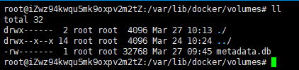

# 说明

- 命令的操作关注点有以下几方面：
  - 有哪些命令
  - 命令的语法
  - 执行命令后，命令做了什么
  - 命令是否有返回结果，如果有，返回的是什么

# 存储概述

docker提供了两种方式来实现将文件持久存储在宿主机中：卷(volume)和绑定挂载(bind mount)。


 # 卷（volumes）

docker把文件系统的某个目录作为卷（在Linux系统中是`/var/lib/docker/volumes/`）。卷由Docker管理。

## 1、-v 和 --mount标志

本来，`-v` (或者`--volume`)用于独立的容器，而 `--mount`用于集群服务。但是从docker 17.06开始，  `--mount` 也可以用于独立的容器。那么我们应该选择哪个呢？推荐使用  `--mount` ,  因为 `-v` 标志把所有的可选项参数合并到一起，而`--mount`把这些可选项参数分开些，更明确。

## 2、创建和管理卷

### （1）create

创建一个名为my-vol的卷。

```
$ docker volume create my-vol
```

原来Linux文件系统目录结构：



创建了名为my-vol的卷后Linux文件系统目录结构：


### （2）list volumes

列出所有的卷。

```
$ docker volume ls
DRIVER              VOLUME NAME
local               my-vol
```

### （3）inspect a volume

`inspect`这个单词的本意是`to look at something or someone carefully` ——仔细查看某个东西。所以要查看某个卷的 `详细信息`，使用该命令。

```
$ docker volume inspect my-vol
[
    {
        "CreatedAt": "0001-01-01T00:00:00Z",
        "Driver": "local",
        "Labels": {},
        "Mountpoint": "/var/lib/docker/volumes/my-vol/_data",
        "Name": "my-vol",
        "Options": {},
        "Scope": "local"
    }
]

```

### （4）remove

```
# docker volume rm my-vol
my-vol
```

卷的全部命令及其用法使用`--help`查看。

## 3、启动一个带卷的容器

下面创建一个名为 `devtest` 的容器，如果启动容器的时候使用的是一个不存在的卷（如接下来示例的myvol2，之前并没有创建该卷），那么docker会自动创建该卷

```
$ docker run -d --name devtest --mount source=myvol2,target=/app nginx:latest
```

 说明：

- `--mount source=myvol2,target=/app`: 使用 `--mount` 标志把卷 `myvol2`挂载到容器的 `/app`目录。注意target和前面的逗号之间不能有空格。

# 绑定挂载（bind mounts）

“绑定挂载”的意思是将`宿主机`上的文件或者目录挂载到容器中，然后容器内的读写是对宿主机文件或目录的读写，自然就实现了存储的持久化。
使用这种方式时，docker就不再创建新的目录，而是通过绝对路径或者相对路径访问宿主机上的文件或者目录。但是每种系统表示路径的方式是不一样的（如Linux系统目录结构是/root, /var,...，而windows系统目录结构是：`c:\\`，`d:\\`，...），这导致了绑定挂载在应用到不同系统的时候可能需要修改路径。所以对于“卷” 和 “绑定挂载”这两种数据管理方式，应该优先选择“卷”这种方式。

## 1、-v 和 --mount用法

- -v 

  由三个字段组成，每个字段之间用冒号(:)隔开。字段之间的顺序是固定的。

  - 第一个字段：宿主机文件或目录。
  - 第二个字段：容器内文件或目录。
  - 第三个字段：可选，该字段可以包含多个值，每个值之间用逗号(,)隔开。如：`ro`，`consistent`，`delegated`，`cached`，`z`，和`Z`。

-  --mount

  由多个键值对(<key>=<value>)组成，每个键值对之间用逗号(,)隔开。虽然这样写语法更长，但是键值对可以不用考虑顺序。常见的键如下：

  - `type`:  挂载的类型。可以是 `bind`,  `volume` 或者 `tmpfs`。绑定挂载对应的是 `bind`。
  - `source`: 宿主机文件或者目录。太长不好记的话也可以用 `src`表示。
  - `destination`: 容器内的文件或者目录。太长不好记的话也可以用 `dst`, `target`表示。
  - `readonly`: 可选，设置挂载的文件或者目录为只读。该键可以不用赋值。
  - `bind-propagation`: 可选。
  - `consistency`: 可选。

## 2、-v和--mount的区别

- -v 和 --mount标志在绑定挂载中的区别
  -v：如果宿主机的文件或者目录不存在，那么Docker会自动创建一个目录。
  -mount：如果宿主机的文件或者目录不存在，那么Docker会报错。
  示例：

  ```
  root@iZwz94kwqu5mk9oxpv2m2tZ:/tmp# docker run -d -it --name devtest --mount type=bind,source="$(pwd)"/target,target=/app nginx:latest
  docker: Error response from daemon: invalid mount config for type "bind": bind source path does not exist: /tmp/target.
  See 'docker run --help'.
  ```

## 3、使用绑定挂载启动一个容器

先在/tmp目录下创建好目录/target，然后启动一个名为devtest的容器，并将/tmp/target目录绑定挂载到容器的/app目录。

```
root@iZwz94kwqu5mk9oxpv2m2tZ:/tmp# docker run -d -it --name devtest --mount type=bind,source="$(pwd)"/target,target=/app nginx:latest
f3c3e45d164c8e7e50e76ae530f6748736799c03a0169aae204d11a3e7248464
```

注：因为/tmp/target目录创建容器前已经创建好，所以此时创建容器就不会报错了。

- 查看容器的具体信息

  ```
  root@iZwz94kwqu5mk9oxpv2m2tZ:/tmp# docker inspect devtest
  ```

  绑定挂载的宿主机目录显示在`Mounts`键下面：

  ```
  "Mounts": [
                  {
                      "Type": "bind",
                      "Source": "/tmp/target",
                      "Target": "/app"
                  }
              ],
  ```

## 3、验证

为了验证这样能实现数据的持久化，我们可以进行一些简单的操作。

- 查看/tmp/target目录

  ```
  root@iZwz94kwqu5mk9oxpv2m2tZ:/tmp/target# ll
  total 8
  drwxr-xr-x  2 root root 4096 Apr  7 16:52 ./
  drwxrwxrwt 10 root root 4096 Apr  7 17:09 ../
  ```

  此时该目录下为空。

- 进入到devtest容器

  ```
  root@iZwz94kwqu5mk9oxpv2m2tZ:~# docker exec -it devtest /bin/bash
  root@f3c3e45d164c:/# 
  ```

- 在/app目录下创建一个名为test的文件

  ```
  root@f3c3e45d164c:/# touch /app/test
  ```

- 再次查看/tmp/target目录

  ```
  oot@iZwz94kwqu5mk9oxpv2m2tZ:/tmp/target# ll
  total 8
  drwxr-xr-x  2 root root 4096 Apr  7 17:12 ./
  drwxrwxrwt 10 root root 4096 Apr  7 17:11 ../
  -rw-r--r--  1 root root    0 Apr  7 17:12 test
  ```

​       此时，可以看到之前为空的宿主机/tmp/target目录下多了一个test文件。其实，在容器的/app目录下进行读写，就是在宿主机/tmp/target下进行读写。

- 停止并删除devtest容器

  ```
  root@iZwz94kwqu5mk9oxpv2m2tZ:~# docker container stop devtest
  devtest
  root@iZwz94kwqu5mk9oxpv2m2tZ:~# docker container rm devtest
  devtest
  ```

- 查看/tmp/target目录下的test文件是否还存在

  ```
  root@iZwz94kwqu5mk9oxpv2m2tZ:~# cd /tmp/target/
  root@iZwz94kwqu5mk9oxpv2m2tZ:/tmp/target# ll
  total 8
  drwxr-xr-x  2 root root 4096 Apr  7 17:12 ./
  drwxrwxrwt 10 root root 4096 Apr  7 17:18 ../
  -rw-r--r--  1 root root    0 Apr  7 17:12 test
  ```

  此时，可以看到即使容器删除了，但是在容器/app目录下创建的test文件依然存在。这样就实现了数据的持久化存储。

# 参考资料

[1]docker文档, https://docs.docker.com/storage/

[2]James Turnbull, 《The Docker Book》:https://github.com/turnbullpress/dockerbook-code