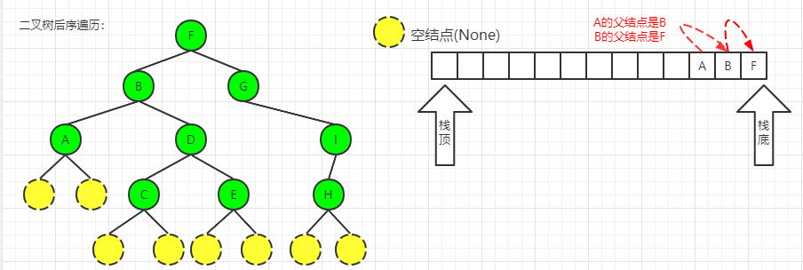
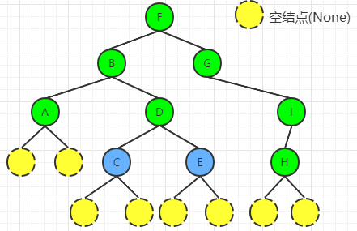

[TOC]

# 概述

 深度优先遍历按照 `根结点` 相对 `左右子结点` 的访问先后来划分。如果把左子结点和右子结点的位置固定不动，那么根结点放在左子节点的左边，称为前序（pre-order）、根节点放在左子结点和右子结点的中间，称为中序（in-order）、根节点放在右子结点的右边，称为后序（post-order）。

# 递归

递归函数的跳出条件是根结点为空树（None）。

## 前序遍历

preorder traversal, NLR。下文用 `访问` 表示 `处理`的意思。

（1）访问根结点。

（2）对左子结点递归。

（3）对右子结点递归。

- 算法实现

```
def preorder_rec(root):
    """
    前序遍历
    :param root: 当前需要遍历的树的根结点
    :return:
    """
    # 跳出递归的条件：根结点为空树
    if root is None:
        # 只写return 默认是返回None
        return
    # 访问根结点
    print(root.val)
    # 左子结点递归
    preorder_rec(root.left)
    # 右子结点递归
    preorder_rec(root.right)

```

## 中序遍历

inorder traversal（NLR）。

（1）对左子结点递归。

（2）访问根结点。

（3）对右子结点递归。

- 算法实现

```
def inorder_rec(root):
    """
    中序遍历
    :param root: 当前需要遍历的树的根结点
    :return:
    """
    # 跳出递归的条件：根结点为空树
    if root is None:
        # 只写return 默认是返回None
        return
    # 左子结点递归
    preorder_rec(root.left)
    # 访问根结点
    print(root.val)
    # 右子结点递归
    preorder_rec(root.right)

```

## 后序遍历

postorder traversal, LRN。

（1）对左子结点递归。

（2）对右子结点递归。

（3）访问根结点。

- 算法实现

```
def postorder_rec(root):
    """
    后序遍历
    :param root: 当前需要遍历的树的根结点
    :return:
    """
    # 跳出递归的条件：根结点为空树
    if root is None:
        # 只写return 默认是返回None
        return
    # 左子结点递归
    preorder_rec(root.left)
    # 右子结点递归
    preorder_rec(root.right)
    # 访问根结点
    print(root.val)
```

# 迭代

因为是深度优先遍历，类似于 `后进先出`，所以可以使用 `栈` 作为缓存，而递归则是隐式地在维护一个栈。

## 前序遍历

（1）因为是前序遍历，所以遇到根结点就应该 `访问`（即处理当前结点的值），然后沿着左分支下行。

（2）因为根结点已经访问了，后续就不需要再访问了，但是通过根结点才能找到右子结点，所以右子结点需要先记录到栈中。

（3）回溯，处理右子结点。

- 算法实现

```
def preorder_iterate(root):
    """

    :param root: 待遍历的树的根结点
    :return:
    """
    # 栈使用列表模拟，用于记录暂时未访问的结点
    stack = []
    while root or stack:
        while root:
            # 先序遍历，先访问根结点
            print(root.val)
            # 因为右子结点在左子结点后面访问，所以要先记录
            stack.append(root.right)
            # 沿左分支下行，直到叶子结点
            root = root.left
        # 回溯,处理右子结点
        root = stack.pop()
```


## 中序遍历

（1）因为是中序遍历，先处理左子结点的值，但是左子结点可能还有左子结点，所以遇到 `根结点` 就先 `记录`（即将根结点存储到栈中），然后沿着左分支下行（因为要一直往下，所以这里蕴含着一个`while`循环），一直到最后一个叶子结点跳出循环。

（2）跳出循环后就回溯——从栈中取出  `根结点`  访问。

（3）访问完根结点后就遍历 `右子结点`。

- 算法实现

```
def inorder_iterate(root):
    """
    中序遍历（迭代）

    :param root: 待遍历的树的根
    :return:
    """
    # 栈使用列表模拟，用于记录暂时未访问的结点
    stack = []
    while root or stack:
        while root:
            # 根结点在左子结点后面访问，所以先记录
            stack.append(root)
            # 沿左分支下行，直到叶子结点
            root = root.left
        # 回溯
        root = stack.pop()
        # 处理根结点
        print(root.val)
        # 处理右结点
        root = root.right
```

## 后序遍历



后续遍历中，栈里序列的特点：**每个结点的父结点就是位于它下面的那个结点**。如上图所示：A结点的父结点就是它下面的结点B，B结点的父结点就是它下面的结点F。因为要先访问完左子结点，才能访问右子结点，所以兄弟结点在栈里是不可能处于相邻位置的，如A、D结点，必须是A结点先出栈，D结点才能入栈。

访问根结点的时候分为两种情况：情况1：当前结点是叶子结点，即左右子结点都是None。情况2：左右子结点都已经访问了，轮到了访问根结点。

- 情况1

  既然左右子结点都要是None，所以 `当前结点` 的左子结点为None的时候，我们就要判断右子结点是否是None。

  示例：如上图所示，遍历到结点A的时候，A的左子结点为None，还要判断右子结点是否是None，如果也是None，那么A结点就是叶子结点了，那么就可以访问A结点了。

- 情况2：

  当我们从栈里取出（即访问）某个结点的时候，其实我们并不知道它是父结点的左结点还是右子结点。

  示例：如下图的C、E结点虽然都是叶子结点，但是C是左子结点，E是右子结点。

  

如果取出的是左子结点（如C结点），那么接着要去访问右子结点（如E结点）；如果取出的是右子结点，那么接着要去访问父结点（如D结点）；如果取出的是最上面的根结点（如结点F），那么就退出循环。那么怎么判断呢？当我们访问当前结点的时候，它的父结点必然位于栈顶。所以我们此时可以根据栈顶元素的左子结点（右子结点）是否等于当前结点判断是那种情况。

示例：如下图所示，如果当前结点是左子结点（如A），那么A的父结点B就位于栈顶，我们将栈顶结点B的左子结点与当前结点比较 `B.left == root`， 然后处理右子结点D，继续进入内层循环。如果当前结点是右子结点（如D），那么应该访问父结点B，所以要跳出大循环，然后根据栈不为空，继续入外层循环，然后取出栈顶结点B。


- 算法实现

```

def postorder_iterate(root):
    """
    后序遍历（迭代）

    :param root: 待遍历的树的根结点
    :return:
    """

    # 栈使用列表模拟，用于记录暂时未访问的结点
    stack = []
    while root or stack:
        while root:  # 内层循环，找到叶子结点
            # 因为是后续遍历，所以当前结点先入栈
            stack.append(root)
            root = root.left if root.left else root.right
        # root可能是叶子结点（左右子结点都为None的根结点），也可能是左右子结点已经遍历了的根结点
        root = stack.pop()
        # 处理根结点
        print(root.val)
        # 如果栈不为空，栈顶元素即为当前结点的父结点，将父结点的左结点与当前结点比较，判断当前结点是左子结点还是右子结点
        # 如果是左子结点，转去处理右子结点
        if stack and stack[-1].left == root:
            root = stack[-1].right
        # 1、如果栈为空：说明遍历全部完成，退出循环。2、如果是右子结点，那么父结点应该出栈，此时继续跳出大循环，然后再入循环
        else:
            root = None

```

# 题目

## 求遍历序列

因为需要一个变量存储序列，所以往往是自己写一个递归方法。

- 前序遍历：[144. Binary Tree Preorder Traversal](https://leetcode.com/problems/binary-tree-preorder-traversal/)

- 中序遍历：[94. Binary Tree Inorder Traversal](https://leetcode.com/problems/binary-tree-inorder-traversal/) 

- 后序遍历：[145. Binary Tree Postorder Traversal](https://leetcode.com/problems/binary-tree-postorder-traversal/)

# 参考资料

[1]裘宗燕，二叉树遍历： https://www.math.pku.edu.cn/teachers/qiuzy/ds_python/courseware/BiTree1.py

