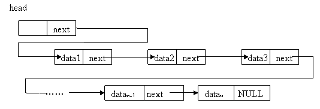

# 一、链表定义

## 1、线性表需求

线性表的基本需求有两点：

- 能够找到线性表的首元素(head)。
- 从线性表的任何一个元素开始，能够找到它之后的下一个元素(next)。

## 2、什么是链表(链接表)

基于链接技术实现的线性表称为链接表（简称 `链表`）。链接技术实现原理：

- 把表中的元素 `分别` 存储在  `独立的存储块`(称为链表的 `结点` )中。
- 在前一节点中 `显示` 的记录下一节点。

# 二、单链表(single linked list)

## 1、定义

`单向链表` 是链接方向为单向的链表。简称 `单链表` 或者 `链表`，一般情况下，我们说的`链表`也是指单向链表。一个单链表的 `结点` 包含两个部分，第一个部分（元素域）存储关于节点的信息(如表示元素的数据项)，第二部分（链接域）存储下一个节点的地址。



([图来自维基百科](https://zh.wikipedia.org/wiki/%E5%8D%95%E5%90%91%E9%93%BE%E8%A1%A8))

### (1)表头变量(表头指针)

可以用一个变量表示单链表的首结点的引用(如上图的head)，这样的变量称为表头变量或者表头指针。

### (2)空链接

为了表示一个单链表的结束，最后一个节点的第二个部分需设置一个表示结束的值在Python里，用None表示，这个值称为 `空链接`。

## 2、节点的算法实现

```
class LNode :
    def __init__(self, elm, nxt):
        self.elem = elm
        self.next = nxt
```

## 3、单链表的算法实现

这是一个最简单的单链表。

```
class LList:
    def __init__(self):
        """
        实例属性head表示首结点的引用
        """
        self.head = None
```

# 三、单链表的操作

操作都在类LList里面定义为方法。

##  1、初始化单链表

把表头变量head的值设置为None。

## 2、判断表是否为空

将表头变量head的值与空值进行比较。

```
 def is_empty(self):
        """判断单链表是否为空"""
        return self.head is None
```

## 3、插入元素

插入元素可以分为表头插入，定位插入，表尾插入。和顺序表的不同的是，在单向链表中插入元素时，并不需要移动已有的元素，而是修改链接，接入新的节点。

### (1)表头插入
表头插入元素只需要两步即可完成。第一步：将原单链表首节点的链接存入新节点的链接域next。第二步：修改表头变量，使之指向新节点。

代码实现：

```
    def prepend(self, elem):
        """
        表头插入元素。
        :param elem: element
        """
        self.head = LNode(elem, self.head)
```

时间复杂度分析：

因为可以通过head直接找到首结点，所以时间复杂度为常量时间复杂度O(1)。

### (2)定位插入

`定位插入`是指在链表的某个位置插入一个新结点。一般需要三步可以完成。第一步：从首结点开始找，找到该位置的前一个节点(pre)。第二步：将前一个节点原来所指向的链接域next存入新结点的链接域next。第三步：修改前一个结点的链接域next，使之指向新结点。

代码实现：

```
q = LNode(13) # 创建一个新节点
q.next = pre.next # 将前一个节点原来所指向的链接域next存入新结点的链接域next
pre.next = q # 修改表头变量，使之指向新节点。
```

时间复杂度：

定位插入元素的时间主要消耗在查找元素。假设单链表有n个结点，在各位置插入时，查找元素次数如下：

| 结点索引    | 查找次数 |
| ----------- | -------- |
| 0(表头插入) | 0        |
| 1           | 1        |
| 2           | 2        |
| ...         | ...      |
| n(表尾插入) | n        |

由上表可得，平均时间复杂度可以用高斯算法进行计算：
$$
\frac{(0+n)*n}{2(n+1)}
$$
即O(n)。

最坏时间复杂度(即表尾插入元素)为：O(n)

### (3)表尾插入

空表：新结点next为空链接，head指向新结点。

非空链表：新结点next为空链接，原单链表的尾结点的next指向新结点，head不变。

代码实现：

```
 def append(self, elem):
        """
        表尾插入元素。
        :param elem: element
        """
        if self.head is None:
            self.head = LNode(elem, self.head)
            return
        p = self.head
        while p.next is not None:
            p = p.nex
        p.next = LNode(elem, None)
```

时间复杂度：

表尾插入即定位插入的最坏情况。总是从首结点开始找，直到找到最后一个结点，所以复杂度为O(n)。

## 4、删除元素

删除元素可以分为表头，定位删除，表尾删除和其它删除。

### (1)表头删除

空表：抛出异常。

非空表：head指向原表的第二个结点，返回被删除的元素值。

代码实现：

```
 def pop(self):
        """
        删除表头元素
        :return: element that deleted
        """
        if self.head is None:
            raise ValueError
        e = self.head.elem
        self.head = self.head.next
        return e 
```

时间复杂度：

无论单链表有多少个元素，删除表头元素都是只要一步即可完成，所以时间复杂度为O(1)。

### (2)定位删除

删除指定位置的元素需要两步实现：第一步：找到指定位置的结点的前一个结点(pre)。第二步骤：修改前一个结点的链接域next，使之指向被删除结点的下一个结点。在Python中，结点被删除后由解释器自动回收。

代码实现：

```
prex.next = pre.next.next # 等号右边的pre.next表示被删除的节点
```

时间复杂度分析：

同定位插入元素，删除指定位置的元素的时间也是主要消耗在查找元素。假设单链表有n个结点，删除指定位置元素时，查找元素次数如下：

| 结点索引    | 查找次数 |
| ----------- | -------- |
| 0(表头插入) | 0        |
| 1           | 1        |
| 2           | 2        |
| ...         | ...      |
| n(表尾插入) | n        |

由上表可得，平均时间复杂度可以用高斯算法进行计算：
$$
\frac{(0+n)*n}{2(n+1)}
$$
约等于O(n)。

最坏时间复杂度(即表尾插入元素)为：O(n)

### (3)表尾删除

空表：抛出异常。

只有一个结点的表：设置head的值为空，返回被删除的元素。

包含两个以上结点的表：从表头开始，找到倒数第二个结点，设置倒数第二个结点的next为空连接。head不变。返回被删除的元素。

代码实现：

```
    def pop_last(self):
        """
        删除表尾元素
        :return:element that deleted
        """
        if self.head is None:
            raise ValueError

        p = self.head
        if p.next is None:
            e = p.elem
            self.head = None
            return e
        # p.next.next表示第二个结点的链接域next
        while p.next.next is not None:
            p = p.next
        e = p.next.elem
        p.next = None
        return e
```


时间复杂度：

表尾删除即定位删除的最坏情况。所以时间复杂度为O(n)。

## 6、扫描、定位和遍历

### (1)扫描

从单链表的表头开始，找到符合条件的节点，这种操作过程称为单链表的 `扫描` 。

代码实现：

```

```

如上代码所示，循环种使用的辅助变量p称为`扫描指针`。

### (2)定位

定位分为两种，按下标定位和按元素定位。

确定第i个元素所在的节点称为按下标定位。按下表定位代码实现：

```
p = head
while p is not None and i > 0:
    i -= 1
    p = p.next
```

确定某个元素所在的节点称为按元素定位。按元素定位代码实现：

```
p = head
while p is not None and p.data == 5:
    p = p.next
```

### (3)遍历

扫描所有的元素称为单链表的 `遍历`。代码实现：

```
    def printall(self):
        p = self.head
        while p is not None:
            print(p.elem, end='')
            if p.next is not None:
                print(', ', end='')
            p = p.next
        print('')
```

## 7、求单链表的长度

从首结点开始，直到结点链接域next为None.

```
    def length(self):
        """
        get the length of singly linked list
        :return: length
        """
        p = self.head
        count = 0
        while p is not None:
            count += 1
            p = p.next
        return count
```

时间复杂度为O(n)。

## 8、单链表反转

### （1）法1：结点之间互相交换

略。

### （2）法2：修改链接

将需要反转的链表的首结点不断取下，然后在另一链表的表头插入，最后将head指向新拼接的链表。

代码实现：

```
    def rev(self):
        """reverse the singly linked list"""

        p = None
        while self.head is not None:
            # 取下首结点
            q = self.head
            self.head = q.next
            # 设置结点的next为之前的取下的结点
            q.next = p
            # 重新给p赋值
            p = q
        self.head = p
```

算法分析：

首结点的取下和加入的操作时间为O(1)，所以链表反转的时间复杂度为O(n)。

## 9、链表排序

采用插入排序进行链表排序。

### (1)法一：元素(elem)交换

该方式的排序本质上是交换了原结点elem值，结点的链接顺序保持不变。

```	
    def sort1(self):
        """通过交换元素排序"""
        if self.head is None:
            return
        # 第一个结点默认已经排序，从第二个结点开始
        crt = self.head.next
        while crt is not None:
            p = self.head
            x = crt.elem
            while p is not crt:
                if p.elem <= x:
                    # 跳到下一个结点
                    p = p.next
                else:
                    # 交换了一个元素，则其它元素也整体向右移动一个位置
                    y = p.elem
                    p.elem = x
                    x = y
                    p = p.next
            # p==crt时，回填crt.elem
            crt.elem = x
            crt = crt.next   
```


### (2)发二：结点插入

该方式的排序本质上是改变结点的链接顺序，结点的elem值保持不变。

```
    def sort2(self):
        """通过结点移动排序"""
        # 空表或者只有一个结点的表
        if self.head is None or self.head.next is None:
            return
        # last: 已排序结点的最后一个结点，初始化时是首结点
        last = self.head
        crt = last.next
        # 遍历未排序的结点
        while crt is not None:
            p = self.head
            q = None
            while p is not crt and p.elem <= crt.elem:
                q = p
                p = p.next
            if p is crt:
                last = crt
            else:
                last.next = crt.next
                crt.next = p
                if q is None:
                    self.head = crt
                else:
                    q.next = crt
            crt = last.next
```

# 问题

## 1、链表转顺序表


# 参考资料

[1]裘宗燕. 数据结构与算法[M]. 北京:  机械工业出版社, 2017.

[2] 裘宗燕, http://www.math.pku.edu.cn/teachers/qiuzy/ds_python/courseware/index.htm


