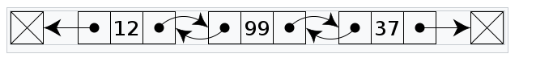

# 定义

如果一个链表的每个结点都有两个 `指针`，分别指向前一结点和后一结点，那么这样的链表称为`双向链接表`(简称 `双链表`)。



（[图来自维基百科](https://zh.wikipedia.org/wiki/%E5%8F%8C%E5%90%91%E9%93%BE%E8%A1%A8)）

# 结点的算法实现

双链表的结点和单链表的结点设计相比，多了对前一个结点的引用。特别地，第一个结点的prev为空，最后一个结点的next为空。

```
class DLNode:
    def __init__(self, prev=None, elem, next=None):
        self.prev = prev
        self.elem = elem
        self.next = next_
```

# 双链表的操作

用变量head记录双链表的首结点，变量rear记录表尾结点。当为空表的时候，head、rear为空。当只有一个结点的时候，head、rear指向同一个结点。

## 1、创建空双链表

即设置head为None。

## 2、判断是否是空表

即判断首结点的引用head或者尾结点的引用rear是否为None。

## 3、添加结点

### （1）表头添加

空表：新结点的prev、next为空链接(None)。head、rear指向新结点。

非空表：新结点的prev为空，next指向原来的首结点；原来的首结点的prev指向新的结点；head指向新结点，rear保持不变。

时间复杂度分析：

因为可以通过属性head直接找到首结点，所以时间复杂度为O(1)。

### （2）表尾添加


空表：新结点prev、next都为空链接。head、rear指向新结点。。

非空表：新结点的prev指向原双链表的rear，next为空链接。原双链表的尾结点指向新结点；head保持不变，rear指向新结点。

时间复杂度分析：

因为可以通过属性head直接找到首结点，通过属性rear找到尾结点，所以时间复杂度为O(1)。

### （3）表头删除

空表：抛出异常。

只含一个结点的表：设置head，rear为空链接。

含两个以上结点的表：设置head指向原表的下一个结点，rear保持不变。原表的第二个结点的prev设置为空链接。

时间复杂度分析：

因为可以通过属性head直接找到首结点，通过属性rear找到尾结点，所以时间复杂度为O(1)。

### （4）表尾删除

空表：抛出异常。

只含一个结点的表：设置head，rear为空链接。

含两个以上结点的表：设置head指向原表的下一个结点，rear保持不变。原表的第二个结点的prev设置为空链接。

时间复杂度分析：

因为可以通过属性head直接找到首结点，通过属性rear找到尾结点，所以时间复杂度为O(1)。

# 双链表的算法实现

```
# -*- coding: utf-8 -*-
"""
 Author: Sweeneys
 DateTime: 2020/4/26 9:24
 reference:
"""


class DLNode:
    def __init__(self, prev, elem, nxt):
        self.elem = elem
        self.prev = prev
        # next是内建函数的名称，所以改为nxt
        self.next = nxt


class DLList:
    def __init__(self):
        # 创建一个空双链表
        self.head = None
        self.rear = None

    def is_empty(self):
        """
        判断双链表是否为空
        :return:
        """
        return self.head is None

    def prepend(self, elem):
        """
        表头插入元素
        """
        p = DLNode(None, elem, self.head)
        self.head = p
        if self.rear is None:
            self.rear = p
        else:
            p.next.prev = p

    def append(self, elem):
        """表尾插入元素"""
        p = DLNode(self.rear, elem, None)
        self.rear = p
        if self.head is None:
            self.head = p
        else:
            p.rev.next = p

    def pop(self):
        """表头删除元素"""
        if self.head is None:
            raise ValueError
        e = self.head.elem
        self.head = self.head.next  # 如果只有一个结点，就是赋值和删除首结点引用；两个以上结点是赋值
        if self.head is None:
            self.rear = None
        else:
            self.head.prev = None
        return e

    def pop_last(self):
        """表尾删除元素"""
        if self.head is None:
            raise ValueError
        e = self.rear.elem
        self.rear = self.rear.prev
        if self.rear is None:
            self.head = None
        else:
            self.rear.next = None
        return e


if __name__ == '__main__':
    dllist = DLList()
    dllist.append(5)
    dllist.prepend(6)
    dllist.append(7)

```


# 参考资料

[1]裘宗燕，《数据结构与算法(Python语言描述)》

[2] 裘宗燕, http://www.math.pku.edu.cn/teachers/qiuzy/ds_python/courseware/index.htm