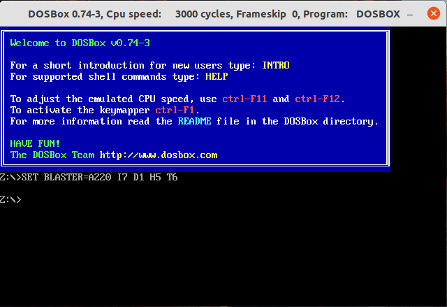
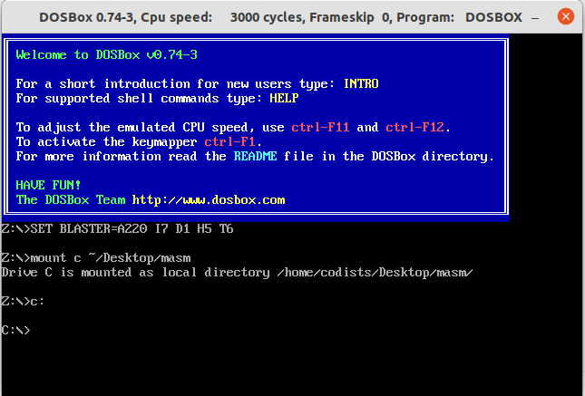
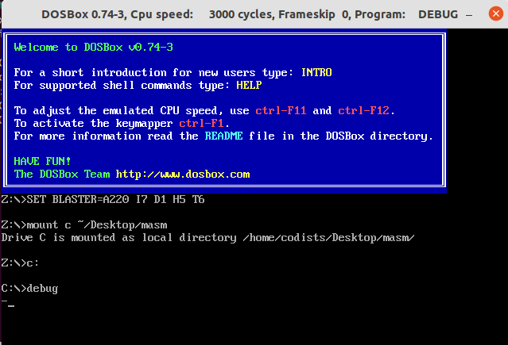
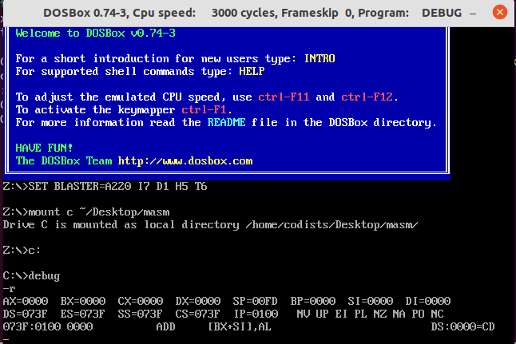

# 说明

1、系统：Ubuntu

```
codists@pc:~$ lsb_release -a
No LSB modules are available.
Distributor ID:	Ubuntu
Description:	Ubuntu 21.10
Release:	21.10
Codename:	impish
```

2、时间：2021年11月14日

3、教材：《汇编语言》（第4版，作者：王爽）

# 安装DOSBOX

```
$ sudo apt install -y dosbox
```

安装结果验证：

```
$ dosbox
```



# 下载Debug等程序

这里不一一列举下载地址了，已将相关的程序压缩到 [DEBUG.zip](https://github.com/codists/learnings/blob/main/assembly/%E6%B1%87%E7%BC%96%E8%AF%AD%E8%A8%80/DEBUG.zip)，大家可以直接下载。下载后放到任意一个目录，如“～/Desktop/masm”。

```
codists@pc:~$ cd ~/Desktop/masm
codists@pc:~/Desktop/masm$ ll
total 1792
drwxrwxr-x 2 codists codists    4096 11月 14 21:05 ./
drwxr-xr-x 3 codists codists    4096 11月  7 20:53 ../
-rw-rw-r-- 1 codists codists     143 11月  7 22:10 1.asm
-rw-rw-r-- 1 codists codists     527 11月  9 22:49 1.EXE
-rw-rw-r-- 1 codists codists      66 11月  9 22:48 1.OBJ
-rw-rw-r-- 1 codists codists       0 10月  2 11:12 2.asm
-rw-rw-r-- 1 codists codists     109 11月 14 21:05 2x2.asm
-rw-rw-r-- 1 codists codists     118 11月 11 21:15 3.ASM
-rw-rw-r-- 1 codists codists   20634  4月 14  2008 DEBUG.EXE
-rw-rw-r-- 1 codists codists   72174  5月 13  1998 EDIT.COM
-rw-rw-r-- 1 codists codists    3050  4月  6  2001 EXE2BIN.EXE
-rw-rw-r-- 1 codists codists   49661  5月  2  2011 LIB.EXE
-rw-rw-r-- 1 codists codists   69133  4月  6  2001 LINK.EXE
-rw-rw-r-- 1 codists codists  103175  4月  6  2001 MASM.EXE
-rw-rw-r-- 1 codists codists 1474560  4月  7  2009 masm.IMg
```

# 将masm目录映射为虚拟C盘



# 执行DEBUG命令

（1）输入debug



如上图所示，输入 `debug` 命令后可以在新的一行会出现一条横线，我们可以在后面输入相关的命令，如 r:



《汇编语言》中的开发环境配置完毕。

