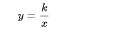

# 一、建议学习计划

## 1、学习进度：2章/天

## 2、优先级：1

# 二、书结构分析

总计10章，438页。

# 三、学习计划

- 按照“建议学习计划”执行。
  - 每天2章无法完成，改为一章。
- 将知识点绘制成思维导图。
- 答题用纸质文档书写。
- 记录学习时间，然后根据实际时间及时调整学习安排。

# 四、学习记录

## 1、学习时间及进度(20200327)

-  12:00-13:00  p1-p8
- 14:00-15:00 p9-p11
- 15:00-16:00 p12-p14
- 16:00-17:00 p15-p16
- 22:00-23:00 p17-

## 2、学习内容

### 1、整数（Integer）

（1）定义

整数是正整数，0， 负整数的统称。

（2）整数与四则运算

### 2、分数（Fraction）

（1）定义

分数由分子(numerator)和分母(denominator)组成。

（2）倒数(reciprocal)

将一个分数的分子和分母交换位置便得到该分数的倒数。

（3）最小公分母(LCD, the least common denominator)

 多个分数的分母的最小公倍数(LCM, the least common multiple)。

（4）分数与四则运算

### 3、运算符顺序（operations order）

（1）运算符的优先顺序

括号（parenthesis，从内到外）>指数运算（exponent）>乘除法（从左到右）>加减法（从左到右）。

（2）绝对值（absolute value）

绝对值表示数轴上一个数对应的点到原点的距离，用||(absolute value bar)表示。

### 4、代数性质（properties of algebra）

代数表达式化简(algebraic expression):

（1）用已知数代替未知数

将已知数带入的时候最好使用小括号括起来。

（2）合并同类项（like terms）

（3）分配律（contributive property）

$$
a \cdot (b \pm c) = a \cdot b + a \cdot c
$$
拓展：乘法运算定律——交换律，结合律，分配律。

## 3、遇到的问题及解决方法

## 4、学习总结

遇到翻译不通的地方，马上查，不能跳过。因为这有可能后面还会遇到，也有可能这是一个数学术语（如product）。

# 一、线性方程(linear equation)

## 遇到的问题及解决方法

1.jointly proportioanl中文翻译是啥？

## 学习内容

### 1、线性方程

（1）定义

即一次方程，因为在笛卡尔坐标系中，任何一个一次方程的表示都是一条直线。

（2）系数（coefficient）

有线性方程2x + 4y = 7, 那么称2是x的系数。

（3）绝对值方程

绝对值中含有未知数的方程称为绝对值方程。求解绝对值方程时需考虑结果为正负两种情况。如果等式两边都分别有且只有一个绝对值，那么最终只需要其中的一个绝对值考虑正负值情况即可。

（4）无解

如果任何值都不满足方程，那么则称该方程无解，用拉丁字母∅表示。

### 2、实数(real number)

 （1）定义

实数是有理数（rational）和无理数（irrational）的总称，用R(real)表示。

### 3、圆(circle)

（1）半径（radius）

用小写字母r表示。

（2）直径（diameter）

（3）周长（circumference）

（4）圆周率（ratio of the circumference to diameter）

用希腊字母Pi(π)表示。

### 4、比例（proportion）

（1）正比例（directly proportional）

若存在一非零常数k使：y=kx，则称变量y与变量x成比例（有时也称为成正比）。本质：y与x的比值总是常数k，一个变量随着另一个变量的递增而递增。（如圆的周长除以圆的直径的结果总是Pi。）

（2）反比例（ inversly proportional）

存在一非零常数k使:

则称变量y和变量x成反比。本质：y与x的乘积总是常数k。一个变量随着另一个变量的递增而递减。

（3）jointly proportional

### 5、平方(square) & 平方根(square root)

### 6、数与集合

（1）周长（perimeter）

（2）三角形（triangle）

三角形三个内角（angel）度数（degree/measure）之和为180度。

（3）矩形（rectangle）

矩形周长计算公式: P=2(L+W)

## 作业情况统计

（1）结果

总计：407道， 错误：31道，正确：376，正确率：92%

（2）分析

错误原因主要为计算错误，其它为审题错误。

## 总结

1、黑体加粗的文字是强调内容。

2、当在做某个动作的时候，会让我们想起之前做这个动作的时候，此时要防止注意力转移。

3、 必要时，把计算步骤细化，防止计算错误。

# 二、图
## 一、学习内容
1、平面直角坐标系
(1)基础
坐标平面（coordinate plane）。
x轴（x axis）：坐标平面内，水平方向上的数轴(number line)。
y轴（y axis）：坐标平面内，垂直方向上的数轴。
原点（origin）：x轴、y轴交叉点，此时x=0, y=0，记为O(0, 0)。
点（point）：用一对坐标A(x, y)表示，x是该点在x轴上的值，y是该点在y轴上的值。
2、直线
（1）斜率(slope)
直线倾斜程度的度量。斜率越大，则直线越陡，反之越平。
（2）直线斜率计算
给定直线上的两个点(x1, y1)和(x2, y2)，则该直线的斜率为m=(y2 - y1) / (x2- x1)。特别地，水平直线的斜率为0， 垂直直线没有斜率。
（3）直线的表达方式
a.斜截式(slope intercept form)：
已知直线在y轴上的截距(y截距)为b，斜率为m, 那么该直线可用方程：y=mk+b表示。该方程称为直线的斜截式方程，简称斜截式。
缺点：必须知道y截距。
b.点斜式(point slope form)
已知直线上一点(x1, y1)，并且直线的斜率m存在，那么该直线可用方程：y-y1=m(x - x1) 表示。该方程称为直线的点斜式方程，简称点斜式。

（4）平行线（parallel）

一条直线的平行线与该直线的斜率相等。

（5）垂直线（perpendicular）

两条相交垂直直线的斜率乘积为-1。

## 二、遇到的问题及解决方法
1.python如何绘制一次函数图像(linear function)？
手动画了20个图，有点困，不如写个代码画一下，matplotlib走起。matplotlib > 《[PythonDataScienceHandbook](https://github.com/jakevdp/PythonDataScienceHandbook)》。
https://jakevdp.github.io/PythonDataScienceHandbook/04.01-simple-line-plots.html
代码写完后，不如matplotlib也系统学习下？想想手要废了，还是看《beginning and intermediate algebra》吧。

## 三、作业情况统计

（1）结果
   总计：204道， 错误：10道，正确：194，正确率：95%
（2）分析
   错误原因主要为计算错误，其它“手残”-计算正确，写的时候写错了。

## 四、总结

1、看到书上的斜率用m表示，然后想到国内的斜率用k表示。嗯嗯嗯，命名的问题总是要argue一下的，实在不行就上通灵大法，召唤远古数学初代目。

# 三、不等式(inequality)

## 一、学习内容

1、不等式（inequality）

（1）定义

用<(less than)、>(greater than)、≥(greater than or equal to)、≤(less than or equal to) 或者 ≠符号 连接的表达式称为不等式。通常不等式中的数是实数，该不等式表示某个范围的所有实数。

（2）运算

不等式也可以进行加、减、乘、除运算。注意：乘以或者除以一个负数的时候需要变号。

（3）复合不等式

两个或者两个以上的不等式连接在一起称为复合不等式。

（4）绝对值不等式

包含绝对值的不等式称为绝对值不等式。

2、区间（interval  notation）

（1）定义

区间是某个范围的所有实数集合。

（2）表示

区间用符合( 、) 、[ 和 ]表示。其中( 、) 表示“排除”， [ 、 ]表示“包括”。特别地，无限区间用(−∞, +∞,) 表示，+∞（infinity）表示正无穷大， −∞（negative infinity）负无穷大。

（3）区间与逻辑运算符

使用符号U表示两个区间的并集，使用符号 ∩表示两个区间的交集。

## 二、遇到的问题及解决方法

略。

## 三、作业情况统计

（1）结果
     总计：105道， 错误：10道，正确：95，正确率：90%
（2）分析
     错误原因主要为不等式在进行对负数进行乘除的时候未变号。其它的我也不知道当时为什么错，再做一次的时候就它就不错。

## 四、总结

1、部分答案错误：3.1 > 2）、3.3 > 7)、3.3 > 26)、3.3 > 33)。

2、“慢上快下”

# 四、方程组(system of equations)

## 一、学习内容

1、方程组

（1）定义

两个或者两个以上的方程联立得到的组合称为方程组。未知数的值称为方程组的解，方程组的解通常用一对有序的值(x, y)表示。

（2）求解
a、图解法（graphing）
分别把各方程所表示的直线画在图上，直线的交点即为方程组的解。如果两条直线是平行线，则方程组无解（no solution, ∅）；如果两条直线重合，则方程有无穷个解（infinite solution）。
缺点：1.画图必须精确，否则得到的交叉点的坐标可能不准确。 2.非常大的数，或者是小数（decimal）不方便表示。
b、代入消元法（substitution）
对于其中一个方程，用一个未知数表示另一个未知数，然后代入到另一个方程中，从而实现将方程组转为一元一次方程进行求解。
缺点：带入消元法求解时往往包含分数，这无形中增加了解方程组的难度。
c、加减消元法（addition/elimination）
利用相反数的特性，让方程组两边分别相加或者相减从而实现将方程组转变为一元一次方程进行求解。

（3）三元一次方程组

如果方程组中含有三个未知数，每个方程中含有未知数的项的次数都是一，那么这样的方程组称为三元一次方程组。三元一次方程组使用消元法进行求解，解用一组有序的值(x, y, z)表示。

方程组两别分别相加或者相减从而达到将方程组转变为一元一次方程进行求解。

## 二、遇到的问题及解决方法

略。

## 三、作业情况统计

（1）结果
     总计：222道， 错误：7道，正确：215，正确率：96%。
（2）分析
       大概是是因为答案同时要满足两个式子，所以才得以降低错误率。

## 四、总结

1、本题的计算结果，总会莫名其妙的代入到其它题目的方程中，2333~，药丸！
2、计算时尤其要注意正负号问题。解方程是个体力活。

# 五、多项式(polynomials)

## 一、学习内容

1、指数(exponent)
（1）定义
n个相同因数a相乘的积记为aⁿ，其中a称为底数（base），n称为指数，指数位于底数的右上角。一般地，这种求几个相同因素的积的运算称为乘方，乘方的结果称为幂。aⁿ读作“a的n次方”或“a的n次幂“。
（2）幂运算法则
a、乘法法则(product rule of exponent)
同底数幂相乘，底数不变，指数相加。记为：a^m * a^n = a^(m + n)。
b、除法法则(quotient rule)
同底数幂相除，底数不变，指数相减。记为：a^m ÷ a^n = a^(m-n) (a≠0)。
c、幂的乘方
底数不变，指数相乘。记为：(a^m) ^n = (a)^(m * n)。
d、积的乘方
因数乘方再“乘积”。记为：(ab)^m = a^m * b^m。
e、商的乘方
指数不变, 分子分母分别乘方。记为：(a/b)^m = a^m / b^m。
（3）性质
a、当n=0， a^n = 1。
b、当a不等于0， a^(-n) = 1/(a^n)。
2、科学计数法（scientific notation）
(1)定义
用a(1<=a<10)乘以10的n次幂表示一个数的方法称为科学计数法。
3、多项式
（1）单项式（monomial）
由数字或字母的积组成的代数式称为单项式。单独的一个数或一个字母也叫做单项式。单项式中的数字叫做这个单项式的系数，单项式中所有字母的指数的和叫做这个单项式的次数。
（2）多项式（polymonial）
由若干个单项式相加组成的代数式称为多项式。
（3）多项式运算
FOIL: First-Outside-Inside-Last。

## 二、遇到的问题及解决方法

略。

## 三、作业情况统计
（1）结果
          总计：167道， 错误：8道，正确：159道，正确率：95%。
（2）分析
          错误主要原因依然是正负号。

## 四、总结
1、对于包含括号的幂运算，应该遵循由内到外的顺序进行计算。
2、对于包含负指数数的幂运算，应该最后再处理负指数项。

# 六、因式分解（factoring）
## 一、学习内容
1、因式分解
(1)、定义
把一个多项式分解为几个整式（单项式+多项式）乘积的形式，称为多项式的因式分解。如果一个多项式无法进行因式分解，那么我们就说这个多项式是一个质数(Prime)。
(2)、分解方法
a、公因式分解
多项式中各单项式都含有的因式称为这个多项式的公因式。通过提取最大公因式（GCF）可以对一个多项式进行因式分解。
b、分组分解
先对多项式进行分组，然后再提取最大公因式进行因式分解。一般用于含有四项的多项式，可进行两两分组或者三一分组。
c、十字相乘法
十字左边相乘等于二次项系数，右边相乘等于常数项，交叉相乘再相加等于一次项。
d、公式法
平方差公式：a^2 - b^2 = (a + b)(a - b)
平方和公式：a^2 + b^2 = Prime
完全平方公式：a^2 + 2ab +  b^2 = (a + b)^2
立方和公式：a^3 + b^3 = (a + b)(a^2 - ab + b^2)
立方差公式：a^3 - b^3 = (a - b)(a^2 + ab + b^2)
3、因式分解方法选择
二项式——平方和、平方差、立方和、立方差公式。
三项式——十字相乘法。
四项式——分组分解。
4、利用因式分解解二次方程

## 二、遇到的问题及解决方法
略。
## 三、作业情况统计
（1）结果
    总计：259道， 错误：11道，正确：248道，正确率：95。
（2）分析
   略。

## 四、总结
1、因式分解必须分解到每个多项式不能再分解为止。
2、因式分解时应该优先提取所有项的最大公因式。

# 七、有理式(rational expression)
## 一、学习内容
1、有理式（rational expression）
（1）定义
		 有多项式A，B(B不等于0)，则A/B称为有理式。有理式包括分式和整式。
（2）有理式的计算
a、化简：化简时，分子分母先各自进行因式分解，然后再约掉公因式。
b、四则运算：和分数的四则运算类似。
2、繁分数（complex fraction）
（1）定义
分子(或分母)含有四则运算(或分数)的数称为繁分数。
（2）化简
首先分子分母的每一项乘以它们的最小公分母，然后进行四则运算，最后进行化简。
3、比例（proportion）
（1）定义
两个或多个相等的有理式互为比例。
（2）性质
如果a/b = c/d, 则 ad = bc。
4、有理方程（rational equation）
（1）定义
包含有理式的方程称为有理方程。

## 二、遇到的问题及解决方法

1、3a/2是不是分式，是不是整式，是不是有理式？
不是分式，但是是整式（具体说是单项式），所以也是有理式。
## 三、作业情况统计
（1）结果
    总计：168道， 错误：13道，正确：155道，正确率：92%。
（2）分析
   主要错误原因是对“有理式化简”理解不到位，以为只是分子分母约掉公因式即可，实际上除了约掉公因式，还需要做因式分解。次要错误原因为手误，为了追求速度所产生的错误。

## 四、总结
1、当计算分母不能为零，变量的取值时，不考虑化简。
2、化简时要遵循因式分解原则，分子分母化简到不能再因式分解，优先考虑公因式分解。

# 八、根(radical)
## 一、学习内容
1、根号
（1）定义
根号用于表示对于一个数或者一个表达式进行开方运算的符号。
2、平方根(square root)
（1）定义
如果一个非负数x的平方为a，即x^2=a, 则x叫做a的算术平方根,  平方根用√￣符号表示，读作“根号a”。
（2）完全平方数(perfect square)
如果一个数能表示成某个数的平方，那么这个称为完全平方数。
3、分母有理化(rationalize)
（1）定义
将无理数分母化为有理数的过程，即去掉分母的根号。在对根式进行计算时，最后得到的结果要将分母有理化。
（2）共轭(conjugate)根式
对于非零根式A、B，如果它们的积不含根式，则A、B互为共轭根式。共轭根式的一个特点是连接项的符号相反，项相同。
4、运算
（1）乘法/除法
          同次根式相乘除，被开方数(radicand)相乘除，根指数不变。不同根次相乘除，先化为相同根次再计算。
（2）加法/减法
          同次根式相加减类似于未知数的相加减。
（3）化简
          根式次数，指数同时除以公因数。
进行根式运算时，必须运算到不能再开方为止，同时分母不能含有根式。
5、有理数幂
（1）定义

负号表示倒数。
（2）化简
如果一个根式既含有指数，又含有根式，那么指数和根式的次数可以同时除以公因数，从而达到化简的结果；
如果是多个根式相乘，那么可以寻找根式的公次数进行化简。
6、复数(complex number)
(1)定义
我们把形如z=a+bi（a,b均为实数）的数称为复数，其中a称为实部(real part)，b称为虚部(imaginary part)，i称为虚数单位。
(2)i的性质
i^2 = -1。
(3)运算
加减法：实部或者虚部分别相加减。
乘除法：实数或者虚数分别相乘除。
运算的最终结果要结合i的性质进行化简，分母有理化——即实际表现为i没有指数，分母不能含有i。

## 二、遇到的问题及解决方法
1、“perscription symbol”怎么翻译？
其实是印刷错误," perscription"应该为“prescrption”, "prescrption symbol"就是处方药的标志，字母R尾部多一撇（℞）。
## 三、作业情况统计
（1）结果
    总计：336道， 错误：27道，正确：309道，正确率：91%。
（2）分析
	主要错误原因一时计算不出，心里比较烦躁，再加上总想着快点往前，所以总是莫名奇妙的漏写，或者正负数写反，或者根号写反。
## 四、总结
1、先化简，后计算。
2、计算时注意正负号；注意次数，次数为2时可以省略，其它次数不能省略；注意根号前面的系数。
3、“it is important to express your answer in the form your instructor prefers”

# 九、二次方程(quadratic)
## 一、学习内容
1、额外解(extraneous solution)
又称伪解(spurious solution)，在解方程中产生的能满足方程，但是不满足原始方程的解。常见于含有开偶次方的方程中。
2、解二次方程
（1）因式分解
    适用于可以因式分解的方程。
（2）开平方法
    a^n = b，如果n为奇数，那么解为b开n次方；如果n为偶数，那么解为正负b开n次方。
（3）配方法(complete the square)
    二次项系数化为1，c = (1/2*b)^2。适用于a=0, b为偶数的情况。
（3）求根公式(quadratic formula)
    a、把方程化为一般形式ax^2 + bx + c=0，从而确定a，b， c的值。
    b、根据判别式b^2 - 4ac的值，判断根的情况。

（4）替代法(substitution)
    将低次幂替换成高次幂，或者将高次幂替换为低次幂，从而将原方程转变为一元二次方程进行求解。
注：a.方程组的解可以用复数表示。
3、二元一次方程组求解
4、二次方程图像
一元二次方程(y=ax^2 + bx + c)的图像是一根抛物线(parabola)。绘制一元二次图像时一般寻找三个点：
a、y截距：令x=0，y=c。
b、x截距：令y=0,  ax^2 + bx + c=0。
c、顶点(vertex): 令x = -b/2a，然后求出y。
(1)、a反映图像开口方向：a>0，图像开口向上;a<0，图像开口向下。

## 二、遇到的问题及解决方法
1、yard(码) vs foot(英尺) vs meter(米/公尺) vs rod(杆)
1yard = 3 feet = 0.9 meter
1foot = 0.3 meter
1rod = 5 meter = 5.5 yard 
2、美国货币单位有哪些？
dollar(美元，$) 、cent(美分，₵)、penny(1美分)、nickle(5美分)、dime(10美分)，quarter dollar(25美分), half dollar(50美分)。
3、mile(英里，简写为mi) vs kilometer(公里) 
1mile = 1.6 km
## 三、作业情况统计
（1）结果
    总计：330道， 错误：23道，正确：307道，正确率：93%。
（2）分析
    错误主要原因为计算遗漏，正负号写反。次要问题为题目理解错误。
## 四、总结
1、对于高次幂，几次幂就有几个解。

# 十、函数(function)
## 一、学习内容
1、函数(function)

（1）定义
对于任意的自变量x，都有唯一因变量y与之对应，那么y称为x的函数，写作y = f(x)。x称为定义域，y称为值域。

2、函数与运算
（1）加法：(f + g)(*x*) = f(*x*) + g(*x*)
（2）减法：(f -  g)(*x*) = f(*x*) + g(*x*)
（3）乘法：(f * g)(x) = f(x) * g(x)
（4）除法：(f  / g)(x) = f(x) / g(x)
（5）函数复合：(g º f)(x) = g(f(x))
3、反函数(inverse function)
（1）定义
设函数f的定义域为X，值域为Y。如果存在函数g（定义域为Y，值域为X），使得对于任意的x∈X，都有g(f(x)) = x，则函数g称为函数f的反函数。
4、指数函数(exponential function) 
（1）定义
          一般地，形如f(x) = a^x的函数称为指数函数。其中，a称为底数(基数，base)，x称为指数    (index/exponent)。
（2）应用 
         指数函数的一个常见运用就是用于复利计算。复利计算公式：
         A = P(1 + r/n)^nt
        A-Final Amount, P-Principle, r-interest rate, n-bumbers of compounded per year, t-time。

5、对数函数(logarithmic function)
（1）定义
         一般地，形如y=logaX（a>0，且a≠1）的函数叫做对数函数。c
6、三角函数(trigonometric function)
（1）直角三角形的三角函数定义
设在直角三角形ACB中，∠ACB为直角，∠BAC大小为θ(theta)，θ的对边(opposite)BC=a、斜边(hypotenuse)AB=c、邻边(adjacent)AC=b。则有：
正弦函数：sinθ = a/c；
余弦函数：cosθ = b/c;
正切函数：tanθ = a/b;
7、反三角函数(inverse trigonometirc function)
（1）定义
“反三角函数”就是三角函数的反函数。
8、勾股定理(Pythegorean theorem)
设在直角三角形中两条直角边的长度分别为a、b,斜边长度是c，则有：
 a^2 +b^2 =c^2

## 二、遇到的问题及解决方法
略。

## 三、作业情况统计
（1）结果
    总计：315道， 错误：19道，正确：296道，正确率：94%。
（2）截图
          介于是最后一课，贴个图。

（3）分析
        主要错误原因为计算错误，以及三角函数计算正切值时，邻边和对边的位置写反。

## 四、总结

终于写完了。从3.29至4.19总计22天，比预计的时间要长一些。从开始到结束，完成的过程基本存在各种失误——正负号写反，本题的答案代入到上一题的式子，漏写等等。有的是源于平时的习惯所引发的失误，有的是完成作业过程中其它因素所导致的“非受迫性失误”。这在以后的日子里依然需要不断的去矫正。这次目标的完成，对于自己的意义主要有以下方面：一、虽然中间有些插曲，但最终还是“苟”完了，不至于烂尾，对于自己来说也算是一个正向的反馈。二、这种方式，某种程度上也算实现了自己对英语与数学的“学以致用”。最后，依然留给自己的问题有：一、如果自己对数学知识需要进一步的系统学习，如何选择下一本教材？二、工作中用到哪些数学知识，怎么分解到教材中?

