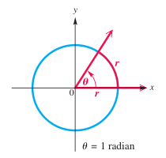
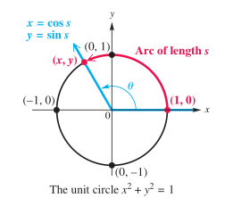
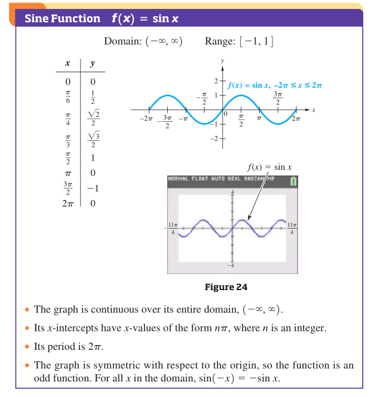
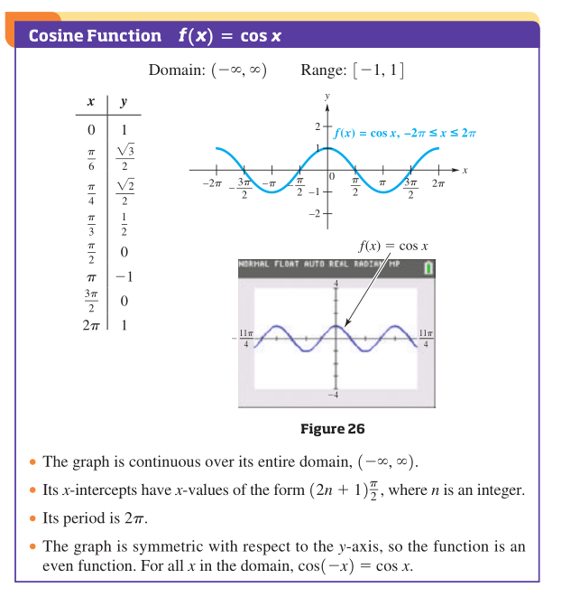

# 6.1、弧度制

## 一、弧度

### 1、定义

用弧长与半径的**比**度量圆心角的方式称为弧度制，用符号rad表示，读作弧度。弧长等于半径的弧(arc)，其所对的圆心角位1弧度(radian)。



## 二、角度和弧度的转换

### 1、转换

基本原理：$360^{\circ}=2\pi$

（1）$1rad = \frac{180^{\circ}}{\pi}$

（2）$1^{\circ}=\frac{\pi}{180}rad$

## 三、弧长

### 1、计算公式（半径，圆心角）

$l=r\theta$

```
l:弧长
r:半径
theta:圆心角大小，单位：弧度。
```

### 2、公式原理

在平面几何(plane geometry)中，圆心角与弧长是成比例的。

## 四、扇形面积

### 1、计算公式（半径，圆心角）

$s=\frac{1}{2}r^2\theta$

## 问题

1、6.1(p595),"圆心角与弧长是成比例的"是来自于哪里呢？

2、6.1第9题，“sq”是什么意思？

3、6.1第89题，自行车走过的距离怎么求？

## 总结

1、$9^{\circ}N$，the north of equator,赤道以北9度。

# 6.2、单位圆与圆函数

## 一、圆函数

### 1、单位圆

在平面直角坐标系中，圆心在原点（0,0），半径为单位长度（1）的圆称为单位圆（unit circle）。方程为：$x^2+y^2=1$ 。



### 2、圆函数

2.1、定义

根据弧长公式$s=r\theta（\theta是弧度）$ ，有：

(1)$sin s=y$、$csc s=\frac{1}{y}$

(2)$cos s=x$、$sec s =\frac{1}{x}$

(3)$tan s=\frac{y}{x}$、$cot s =\frac{x}{y}$

2.2、定义域、值域

（1）sin、cos: $(-\infin, \infin)$，(-1, 1)

（2）tan：$s \neq (2n+1)\frac{\pi}{2}$

（3）cot：$s \neq n\pi$

### 3、参考弧

单位元上的一个点，其参考弧是从该点本身到x轴上最近的点的最短弧。

## 二、圆函数的值

### 1、计算方式

（1）如果有坐标，用坐标计算。

（2）如果没有坐标，将弧度转为角度计算。

### 2、电脑计算器

弧度是"RAD"模式。

## 三、根据函数值求角度

### 1、计算器计算

## 四、函数值作为线段的长度


## 五、线速度和角速度

### 1、线速度(linear speed)

$v=\frac{s}{t}$

```
s:弧长
t:时间
```

### 2、角速度(angular speed)

$w=\frac{\theta}{t}(\theta 单位是弧度)$

注：

### 3、线速度与角速度的关系

$v=rw$

## 问题

1、第63题答案有误，正确答案应该是：0.5423。

2、

## 总结

1、17/3$\pi$先变成真分数，然后再判断与$\pi$或者$2\pi$的关系。

# 6.3、sin&cos函数图像

## 一、周期函数

### 1、定义

形如f(x)=f(x+np)的函数称为周期函数（periodic function）。其中，n是正实数，p是周期(period)。

## 二、sin函数图像

### 1、定义

f(x)=sinx

### 2、性质

正弦函数图像称为正弦曲线(sinusoid)，或者正弦波（sin wave）。

（1）周期性



## 三、余弦函数

### 1、定义

f(x)=cosx

### 2、性质

余弦函数图像成为余弦波(cos wave)，或者余弦曲线。



## 四、绘图、振幅、周期

### 1、振幅

（1）定义

函数图像振幅是指最大值减去最小值的差的一般。振幅是值，不带单位。

垂直方向上的伸缩会影响振幅。

### 2、周期

水平方向上的伸缩会影响周期。

### 3、y=asinbx

画图步骤如下：

（1）找出周期$frac{2\pi}{b}$。

（2）找出一个周期的四个特殊的x值。

（3）计算函数值。

（4）描点。

（5）连线。


## 五、根据函数图像确定函数

## 六、三角函数建模

### 1、平均温度

### 2、收缩压和舒张压

## 总结

1、应用题计算的时候终于不是在中间截取有效数字，而是到最后结果才截取，难得啊~

# 6.4、正弦和余弦函数的平移

## 一、水平移动

### 1、相移

水平方向上的移动称为相移(phase shift)。

### 2、垂直位移

垂直方向上的移动的移动称为垂直位移(vertically shift)。

### 3、方法二

（1）求最大值和最小值：令$0<kx+b<2\pi$，得到min<x<max。

（2）求中间值：mid=(max+min)/2.

（3）求左边的中间值: mid~left~=(min+mid)/2

（4）求右边的中间值：mid~right~=(mid+max)/2

注：

或者令$kx+b=0,\pi/2,\pi, 3\pi/2,2\pi$，分别求出x的值。

## 二、竖直移动

## 三、水平、竖直移动

## 四、三角函数建模

#### 1、y=asin(bx-d)+c

（1）a：振幅，(max-min)/2

（2）c：垂直位移，(max+min)/2

（3）b：周期，2pi/b

（4）d：相移，d/b

# 6.5、

# 参考资料

